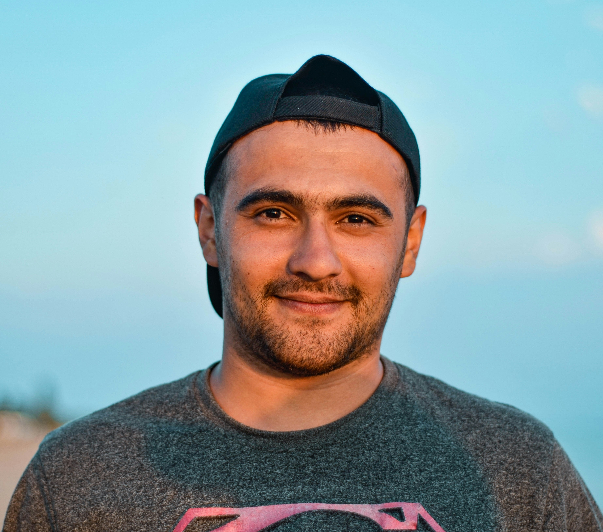

<!-- # KALEIDO: OPEN-SOURCED MULTI-SUBJECT REFERENCE VIDEO GENERATION MODEL
This repository contains the official implementation of **Kaleido**, proposed in our paper:
<a href="https://arxiv.org/abs/2510.18573#">
  
</a>

<div align="center">

</div> -->
<p align="center">
  
</p>

<h1 align="center">KALEIDO: OPEN-SOURCED MULTI-SUBJECT REFERENCE VIDEO GENERATION MODEL</h1>

<div align='center'>
    <a href='https://scholar.google.com/citations?user=6Uqe9ewAAAAJ&hl=zh-CN&oi=sra' target='_blank'>Zhenxing Zhang</a>&emsp;
    <a href='https://scholar.google.com/citations?user=68PC4LMAAAAJ&hl=zh-CN&oi=sra' target='_blank'>Jiayan Teng<sup>†</sup></a>&emsp;
    <a href='https://scholar.google.com/citations?user=tgAt-gEAAAAJ&hl=zh-CN&oi=sra' target='_blank'>Zhuoyi Yang</a>&emsp;
    <a href='#' target='_blank'>Tiankun Cao</a>&emsp;
    <a href='#' target='_blank'>Cheng Wang</a>&emsp;
    <a href='https://scholar.google.com/citations?user=YR4Lp0QAAAAJ&hl=zh-CN&oi=sra' target='_blank'>Xiaotao Gu</a>&emsp;
    <a href='https://scholar.google.com/citations?user=n1zDCkQAAAAJ&hl=zh-CN&oi=ao' target='_blank'>Jie Tang</a>&emsp;
    <a href='https://scholar.google.com/citations?user=DsEONuMAAAAJ&hl=zh-CN&oi=ao' target='_blank'>Dan Guo</a>&emsp;
    <a href='https://scholar.google.com/citations?user=rHagaaIAAAAJ&hl=zh-CN&oi=sra' target='_blank'>Meng Wang<sup>*</sup></a>
</div>
<div align='center'>
    <br><sup>*</sup>Corresponding Author, <sup>†</sup>Project Lead
    <br><strong>Hefei University of Technology • Tsinghua University • Zhipu AI</strong>
</div>

<div align="center">
  <a href='https://arxiv.org/abs/2510.18573'></a>
  <a href='https://huggingface.co/Crilias/Kaleido-14B-S2V'></a>
  <a href='https://criliasmiller.github.io/Kaleido_Project/'></a>
</div>

---

<p align="center">
  
</p>

---
## Update and News

* 2025.10.28: 🔥 We release the checkpoints of Kaleido-14B-S2V.
* 2025.10.22: 🔥 We propose **Kaleido**, a novel multi-subject reference video generation model. Both the **training** and **inference** code have been open-sourced to facilitate further research and reproduction.

## Qucik Start

### Prompt Optimization

Before running the model, please refer to this guide to see how we use large models like GLM-4.5 (or other comparable products, such as GPT-5) to optimize the model. This is crucial because the model is trained with long prompts, and a good prompt directly impacts the quality of the video generation.

### Diffusers

**Please make sure your Python version is between 3.10 and 3.12, inclusive of both 3.10 and 3.12.**

```
pip install -r requirements.txt
```

### Checkpoints Download

<!-- **Note:** Due to double-blind review requirements, we do not provide the checkpoint download link here.  -->

| ckpts       | Download Link                                                                                                                                           |    Notes                      |
|--------------|---------------------------------------------------------------------------------------------------------------------------------------------------------|-------------------------------|
| Kaleido-14B | 🤗 [Huggingface](https://huggingface.co/Crilias/Kaleido-14B-S2V/tree/main)   | Supports  512P

Use the following commands to download the model weights
(We have integrated both Wan VAE and T5 modules into this checkpoint for convenience).

```bash
# Download the repository (skip automatic LFS file downloads)
GIT_LFS_SKIP_SMUDGE=1 git clone https://huggingface.co/Crilias/Kaleido-14B-S2V

# Enter the repository folder
cd Kaleido-14B-S2V

# Merge the checkpoint files
python merge_kaleido.py
```

Arrange the model files into the following structure:

```text
.
├── Kaleido-14B-S2V
│   ├── model
│   │   └── ....
│   ├── Wan2.1_VAE.pth
│   │
│   └── umt5-xxl
│       └── ....
├── configs
├── sat
└── sgm
```

## Usage
### Inference

```bash
python sample_video.py --base configs/video_model/dit_crossattn_14B_wanvae.yaml configs/sampling sample_wanvae_concat_14b.yaml
```

You can also use multiple GPUs to accelerate the inference process:

```bash
bash torchrun_multi_gpu.sh
```
You can accelerate the inference process by utilizing multiple GPUs. Additionally, you can enable Sequence Parallelism in the YAML configuration file to further speed up inference.
```yaml
args:
  s2v_concat: True
  ....
  sequence_parallel_size: 8
```

**Note:** The condition input txt file should contain lines in the following format:
```
prompt@@image1.png@@image2.png@@image3.png
```

### Training

```
python train_video_concat.py --base configs/video_model/dit_crossattn_14B_wanvae.yaml configs/training/video_wabx_14B_concat.yaml
```
**Note:** Our training strategy is based on the CogivideoX model. For detailed information about the training process, please refer to the [CogivideoX repository](https://github.com/zai-org/CogVideo).In addition to the DeepSpeed training approach, we also provide an implementation using FSDP2 for distributed training.

## Gallery

Our model can broadly reference various types of images, including humans, objects, and diverse scenarios such as try-on.
This demonstrates its versatility and generalization ability across different tasks.

<table style="width: 100%; border-collapse: collapse; text-align: center; border: 1px solid #ccc; table-layout: auto;">
  <tr>
    <th style="text-align: center; width: 40%;">
      <strong>Reference Images</strong>
    </th>
    <th style="text-align: center; width: 60%;">
      <strong>Kaleido Results</strong>
    </th>
  </tr>


  <tr>
    <td style="text-align: center; vertical-align: middle; padding: 10px; width: 40%;">
      
    </td>
    <td style="text-align: center; vertical-align: middle; padding: 10px; width: 60%;">
      
    </td>
  </tr>

  <tr>
    <td style="text-align: center; vertical-align: middle; padding: 10px; width: 40%;">
      <div style="display: flex; justify-content: center; gap: 10px; align-items: center;">
        
        
      </div>
    </td>
    <td style="text-align: center; vertical-align: middle; padding: 10px; width: 60%;">
      
    </td>
  </tr>

  <tr>
    <td style="text-align: center; vertical-align: middle; padding: 10px; width: 40%;">
      <div style="display: flex; justify-content: center; gap: 10px; align-items: center;">
        
        
      </div>
    </td>
    <td style="text-align: center; vertical-align: middle; padding: 10px; width: 60%;">
      
    </td>
  </tr>


  <tr>
    <td style="text-align: center; vertical-align: middle; padding: 10px; width: 40%;">
      <div style="display: flex; justify-content: center; gap: 10px; align-items: center;">
        
        
      </div>
    </td>
    <td style="text-align: center; vertical-align: middle; padding: 10px; width: 60%;">
      
    </td>
  </tr>

  <tr>
    <td style="text-align: center; vertical-align: middle; padding: 10px; width: 40%;">
      <div style="display: flex; justify-content: center; gap: 10px; align-items: center;">
        
        
      </div>
    </td>
    <td style="text-align: center; vertical-align: middle; padding: 10px; width: 60%;">
      
    </td>
  </tr>


  <tr>
    <td style="text-align: center; vertical-align: middle; padding: 10px; width: 40%;">
      <div style="display: flex; justify-content: center; gap: 8px; align-items: center; flex-wrap: wrap;">
        
        
        
      </div>
    </td>
    <td style="text-align: center; vertical-align: middle; padding: 10px; width: 60%;">
      
    </td>
  </tr>

  <tr>
    <td style="text-align: center; vertical-align: middle; padding: 10px; width: 40%;">
      <div style="display: flex; justify-content: center; gap: 8px; align-items: center; flex-wrap: wrap;">
        
        
        
      </div>
    </td>
    <td style="text-align: center; vertical-align: middle; padding: 10px; width: 60%;">
      
    </td>
  </tr>

</table>

## Todo List
- [x] Inference codes and Training codes for Kaleido
- [x] Checkpoint of Kaleido
- [ ] Datapipline of Kaleido

## Citation 
If you find our work helpful, please cite our paper:

```bibtex
@misc{zhang2025kaleidoopensourcedmultisubjectreference,
      title={Kaleido: Open-Sourced Multi-Subject Reference Video Generation Model}, 
      author={Zhenxing Zhang and Jiayan Teng and Zhuoyi Yang and Tiankun Cao and Cheng Wang and Xiaotao Gu and Jie Tang and Dan Guo and Meng Wang},
      year={2025},
      eprint={2510.18573},
      archivePrefix={arXiv},
      primaryClass={cs.CV},
      url={https://arxiv.org/abs/2510.18573}, 
}
